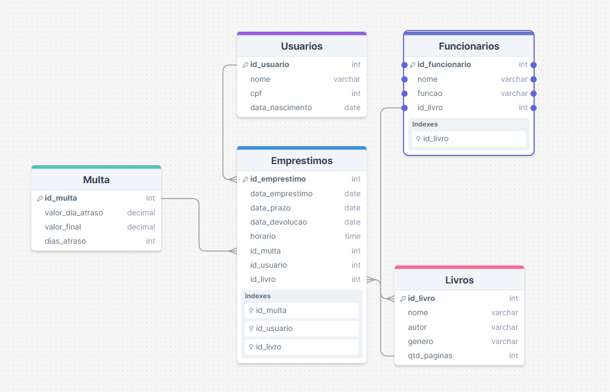

# DB
## Criar DB
```sql
CREATE DATABASE bibliotechDB
```

## Criar tabelas
```sql
ERRO
```

## código para conectar no BD 

```c#
public static void InitConexao(){
            string info = "server=localhost;database=bibliotechDB;user id=root;password=''";
            conexao = new MySqlConnection(info);
            try {
                conexao.Open();
            } catch {
                MessageBox.Show("Não deu, foi mal");
            }
        }
        public static void CloseConexao() {
            conexao.Close();
        }
```


### FOR TESTS

```sql
CREATE DATABASE if NOT EXISTS bibliotechDB;
USE bibliotechDB;

CREATE TABLE if NOT EXISTS `Multa` (
    `id_multa` INT UNSIGNED NOT NULL AUTO_INCREMENT PRIMARY KEY,
    `valor_dia_atraso` DECIMAL(10,2) NOT NULL,
    `valor_final` DECIMAL(10,2) NOT NULL,
    `dias_atraso` INT NOT NULL
);

CREATE TABLE if NOT EXISTS `Usuarios` (
    `id_usuario` INT UNSIGNED NOT NULL AUTO_INCREMENT PRIMARY KEY,
    `nome` VARCHAR(255) NOT NULL,
    `cpf` INT NOT NULL,
    `data_nascimento` VARCHAR(10) NOT NULL
);

CREATE TABLE if NOT EXISTS `Livros` (
    `id_livro` INT UNSIGNED NOT NULL AUTO_INCREMENT PRIMARY KEY,
    `nome` VARCHAR(255) NOT NULL,
    `autor` VARCHAR(255) NOT NULL,
    `genero` VARCHAR(255) NOT NULL,
    `qtd_paginas` INT NOT NULL
);

CREATE TABLE if NOT EXISTS `Funcionarios` (
    `id_funcionario` INT UNSIGNED NOT NULL AUTO_INCREMENT PRIMARY KEY,
    `nome` VARCHAR(255) NOT NULL,
    `funcao` VARCHAR(255) NOT NULL,
    `id_livro` INT UNSIGNED NOT NULL,
    INDEX (`id_livro`),
    FOREIGN KEY (`id_livro`) REFERENCES `Livros`(`id_livro`)
);

CREATE TABLE if NOT EXISTS `Emprestimos` (
    `id_emprestimo` INT UNSIGNED NOT NULL AUTO_INCREMENT PRIMARY KEY,
    `data_emprestimo` VARCHAR(10) NOT NULL,
    `data_prazo` VARCHAR(10) NOT NULL,
    `data_devolucao` VARCHAR(10) NOT NULL,
    `horario` VARCHAR(8) NOT NULL,
    `id_multa` INT UNSIGNED NOT NULL,
    `id_usuario` INT UNSIGNED NOT NULL,
    `id_livro` INT UNSIGNED NOT NULL,
    INDEX (`id_multa`),
    INDEX (`id_usuario`),
    INDEX (`id_livro`),
    FOREIGN KEY (`id_multa`) REFERENCES `Multa`(`id_multa`),
    FOREIGN KEY (`id_usuario`) REFERENCES `Usuarios`(`id_usuario`),
    FOREIGN KEY (`id_livro`) REFERENCES `Livros`(`id_livro`)
);

```